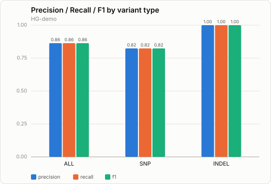

# Accuracy benchmarking (H4)

The pipeline can score its own calls against a truth/gold-standard VCF and report
**precision, recall and F1** — overall and split by SNP vs INDEL — optionally
restricted to high-confidence regions.

## Two backends

| `--benchmark_tool` | Tool | Use |
|---|---|---|
| `builtin` *(default)* | `bin/benchmark_vcf.py` (stdlib) | Fast, offline, always available; exact `(chrom,pos,ref,alt)` matching. Good for CI and the synthetic truth set. |
| `happy` | GA4GH **hap.py** | Rigorous, publication-grade; handles left-alignment, block substitutions and complex representation the built-in matcher does not. Use for real gold standards. |

Both emit the **same** metrics JSON/TSV shape, so the report/MultiQC don't care
which produced them (`parse_happy.py` folds hap.py's `summary.csv` into that shape).

## Running it

Opt-in with `--benchmark` and a truth set:

```bash
# Built-in concordance (works on the bundled synthetic truth set)
nextflow run main.nf -profile test,docker \
  --benchmark --truth assets/test_data/truth.vcf

# hap.py against a real gold standard, restricted to confident regions
nextflow run main.nf -profile docker --genome GRCh38 --input samplesheet.csv \
  --benchmark --benchmark_tool happy \
  --truth /refs/HG002_GRCh38.vcf.gz \
  --truth_bed /refs/HG002_GRCh38_confident.bed
```

Outputs land in `results/benchmark/<sample>/<sample>.benchmark.{json,tsv}` and the
TSV is picked up by MultiQC.

## Visualizations

`bin/plot_accuracy.py` renders three self-contained **SVG** charts from the
benchmark JSON (no matplotlib/JS — stdlib only, colourblind-safe palette). They
are produced automatically by the `PLOT_ACCURACY` step whenever `--benchmark`
runs, and land next to the metrics in `results/benchmark/<sample>/`:

| Chart | What it shows |
|---|---|
| **Precision–Recall** | precision vs recall as the QUAL threshold sweeps (the classic ML PR curve); the best-F1 operating point is ringed |
| **F1 by variant type** | precision / recall / F1 grouped for ALL / SNP / INDEL |
| **Genotype concordance** | truth-vs-called genotype confusion heatmap (het / hom-alt / hom-ref) |

You can also render them ad hoc from any benchmark JSON:

```bash
bin/plot_accuracy.py results/benchmark/HG002/HG002.benchmark.json \
  --outdir plots --prefix HG002
```

The images below are **illustrative — generated on synthetic demo data**
(P = R = F1 = 0.86, genotype concordance 0.95), not a real evaluation. Replace
them with your own GIAB run for the real, publication-comparable numbers.





## Gold standards (GIAB)

The [Genome in a Bottle](https://www.nist.gov/programs-projects/genome-bottle)
consortium publishes high-confidence truth sets and regions:

- **HG001 (NA12878)** and **HG002 (Ashkenazi son)** are the usual references.
- Use the truth VCF **and** its high-confidence BED (`--truth_bed`); scoring
  outside confident regions is not meaningful.
- Match the truth set's reference build to `--genome` (GRCh38 vs GRCh37).

`vcfeval` (RTG Tools) is an equally valid engine; it can be added as a third
`--benchmark_tool` alongside hap.py using the same `parse_*` → metrics pattern.

## On Ubuntu (WSL)

- The `builtin` backend is pure Python — no extra setup.
- **hap.py** is Python 2-era and is easiest via its container: run
  `-profile docker` (Docker Desktop WSL integration) or `-profile singularity`.
  Verify the image pulls first with `bin/verify_containers.sh`.
- Keep the truth VCF/BED and work dir on the Linux filesystem (not `/mnt/c`);
  see docs/REFERENCES.md.

## What "accuracy" means here

Metrics reflect concordance with the chosen truth set within the chosen regions.
They are a development/QC signal, **not** a clinical validation — outputs remain
research-use-only until a formal clinical validation is performed.
