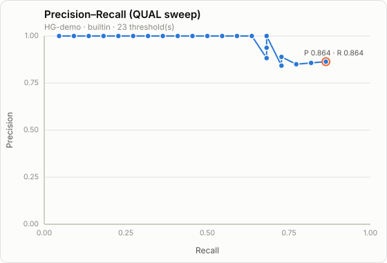
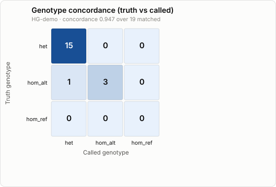

# ngs-variant-pipeline

[](https://github.com/mbote-droid/ngs-variant-pipeline/actions/workflows/ci.yml)

A reproducible, containerized clinical-genomics pipeline built with **Nextflow**:
from raw sequencing reads to an evidence-cited, clinician-readable report. It runs
identically on a laptop (small data) or on cloud/HPC (full data), and layers an AI
interpretation stage on top of standard best-practice genomics tooling.

> Status: **Complete germline pipeline (M1-M6):** reads -> QC -> align -> call ->
> annotate -> prioritize -> report, with a single MultiQC over every stage. See
> `ROADMAP.md` for the build plan, `ARCHITECTURE.md` for the design, and
> [`docs/EXAMPLE_OUTPUT.md`](docs/EXAMPLE_OUTPUT.md) for a real-run snapshot.
> Somatic mode, long-read, and the cloud profile are next. Research use only.

## Requirements
- Nextflow (>= 24.04), Java 17-21
- One tool provisioner: **conda/mamba** (primary on low-RAM hosts) or Docker/Singularity
- Python 3.9+ (stdlib only) for the samplesheet validator and its tests

## Input: samplesheet
A CSV with a header. `sample` and `fastq_1` are required; `fastq_2` (paired-end)
and `status` (0 = normal/germline, 1 = tumor; reserved for somatic mode) are
optional. A sample may span multiple rows (e.g. one FASTQ pair per lane).

```csv
sample,fastq_1,fastq_2
sample1,reads/s1_R1.fastq.gz,reads/s1_R2.fastq.gz
```

## Quick start
Run the Input + QC stage on the bundled synthetic test data:
```bash
# with conda-provisioned tools
nextflow run main.nf -profile test,conda

# or, to verify wiring with no tools/network (touches stub outputs)
nextflow run main.nf -profile test -stub
```
On your own data:
```bash
nextflow run main.nf --input samplesheet.csv -profile conda
```
For a **real genome** end-to-end (GRCh38 + evidence + GIAB accuracy benchmark) on
Ubuntu/WSL, follow the copy-paste **[WSL runbook](docs/RUNBOOK_WSL.md)**.
Outputs land under `results/`: `qc/fastqc/`, `preprocessing/fastp/`,
`multiqc/multiqc_report.html`, and provenance in `pipeline_info/`.

**Long reads:** `--long_read` swaps in a Nanopore/PacBio path — minimap2 +
Clair3 (small variants) + Sniffles2 (structural variants) — reusing the same
annotation and report layer. See **[LONGREAD.md](docs/LONGREAD.md)**.

**Any scale, no code changes:** the same workflow runs on a laptop, an HPC
cluster (`-profile slurm,singularity`), or the cloud (`-profile aws` / `google`
/ `azure`) — only the executor profile changes. See **[CLOUD.md](docs/CLOUD.md)**.
For the design + testing/security strategy, see **[QUALITY.md](docs/QUALITY.md)**.

**Multiple samples / lanes:** samples split across lanes are merged automatically;
`--joint` runs GATK cohort joint genotyping (one multi-sample callset + a report
per sample). See **[COHORT.md](docs/COHORT.md)**. Tumor/normal somatic calling is
**[SOMATIC.md](docs/SOMATIC.md)** (`--somatic`).

**Interoperable output:** each report includes an HL7 Genomics Reporting
IG-aligned **FHIR R4** bundle (`<sample>.fhir.json`) — Patient + Specimen +
genomic-report DiagnosticReport + LOINC-coded variant Observations — with an
offline structural validator (`bin/validate_fhir.py`, run in CI). See
**[FHIR.md](docs/FHIR.md)**.

## Accuracy
Calls are scored against a truth set (precision / recall / F1, split by SNP/INDEL,
plus genotype concordance) via `--benchmark` — a stdlib exact-match backend or
GA4GH hap.py against GIAB. See **[ACCURACY.md](ACCURACY.md)** for the method and
the GIAB workflow. Example charts (illustrative, on synthetic data):




## Tests
The Python components (samplesheet validator, prioritization + ACMG, benchmarking,
plotting) have standalone pytest suites (no pipeline needed):
```bash
pytest -q
```

## Roadmap (short)
Germline short-read Illumina first, then somatic, then long-read. See `ROADMAP.md`.
